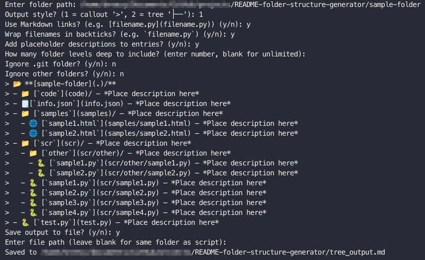
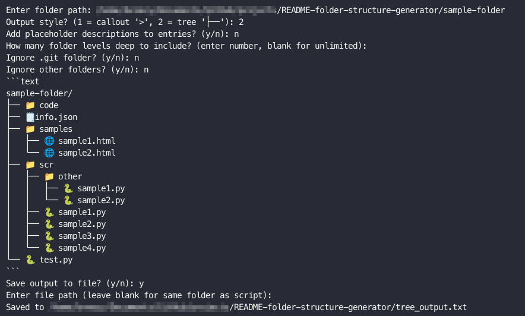

# Markdown Tree Generator

```text
╔════╗╔═══╗╔═══╗╔═══╗    ╔═══╗╔═══╗╔═╗ ╔╗╔═══╗╔═══╗╔═══╗╔════╗╔═══╗╔═══╗
║╔╗╔╗║║╔═╗║║╔══╝║╔══╝    ║╔═╗║║╔══╝║║╚╗║║║╔══╝║╔═╗║║╔═╗║║╔╗╔╗║║╔═╗║║╔═╗║
╚╝║║╚╝║╚═╝║║╚══╗║╚══╗    ║║ ╚╝║╚══╗║╔╗╚╝║║╚══╗║╚═╝║║║ ║║╚╝║║╚╝║║ ║║║╚═╝║
  ║║  ║╔╗╔╝║╔══╝║╔══╝    ║║╔═╗║╔══╝║║╚╗║║║╔══╝║╔╗╔╝║╚═╝║  ║║  ║║ ║║║╔╗╔╝
 ╔╝╚╗ ║║║╚╗║╚══╗║╚══╗    ║╚╩═║║╚══╗║║ ║║║║╚══╗║║║╚╗║╔═╗║ ╔╝╚╗ ║╚═╝║║║║╚╗
 ╚══╝ ╚╝╚═╝╚═══╝╚═══╝    ╚═══╝╚═══╝╚╝ ╚═╝╚═══╝╚╝╚═╝╚╝ ╚╝ ╚══╝ ╚═══╝╚╝╚═╝
```

Turn your messy folders into **beautiful Markdown directory trees** complete with icons, links, and descriptions.
Perfect for READMEs, documentation, or just showing off your project structure in style.

---

## Features

* **Two output styles:**

  * 🟦 *Callout Mode* → collapsible, doc-style trees with `>`
  * 🌳 *Tree Mode* → ASCII-style directory trees (`├──`, `└──`)

* **Optional extras:**

  * Markdown links to files and folders
  * Placeholder descriptions for each entry
  * Backtick wrapping for filenames
  * Ignore unwanted folders like `.git`

* **Customisable depth:** show *all levels* or just a few.

* **Save your output:** Write results to `.md` or `.txt` for easy reuse.

---

## Usage

To quickly try it out, use the included `sample-folder` in the repo (contains a set of empty files):

```bash
python treegen.py
```

Then follow the prompts:

* Enter the folder path: `sample-folder`
* Pick an output style (*callout* or *tree*)
* Choose whether to add links, backticks, placeholders, etc.
* Save output to file if you want

This lets you instantly preview how the generator works using the provided example structure.

---

## Examples

### 1. Callout Mode

Neat, doc-friendly look:

> 📂 **[sample-folder](.)/**
> 
> - 📁 [`code`](code)/ — *Place description here*
> - 🗒️ [`info.json`](info.json) — *Place description here*
> - 📁 [`samples`](samples)/ — *Place description here*
>   - 🌐 [`sample1.html`](samples/sample1.html) — *Place description here*
>   - 🌐 [`sample2.html`](samples/sample2.html) — *Place description here*
> - 📁 [`scr`](scr)/ — *Place description here*
>   - 📁 [`other`](scr/other)/ — *Place description here*
>     - 🐍 [`sample1.py`](scr/other/sample1.py) — *Place description here*
>     - 🐍 [`sample2.py`](scr/other/sample2.py) — *Place description here*
>   - 🐍 [`sample1.py`](scr/sample1.py) — *Place description here*
>   - 🐍 [`sample2.py`](scr/sample2.py) — *Place description here*
>   - 🐍 [`sample3.py`](scr/sample3.py) — *Place description here*
>   - 🐍 [`sample4.py`](scr/sample4.py) — *Place description here*
> - 🐍 [`test.py`](test.py) — *Place description here*

💡 Great for README files or wikis where you want collapsible, linked trees.

---

### 2. Tree Mode

Classic developer look:

```text
sample-folder/
├── 📁 code
├── 🗒️ info.json
├── 📁 samples
│   ├── 🌐 sample1.html
│   └── 🌐 sample2.html
├── 📁 scr
│   ├── 📁 other
│   │   ├── 🐍 sample1.py
│   │   └── 🐍 sample2.py
│   ├── 🐍 sample1.py
│   ├── 🐍 sample2.py
│   ├── 🐍 sample3.py
│   └── 🐍 sample4.py
└── 🐍 test.py
```

Great for showing project structure like a pro.

---

## Screenshots

<p align="center">
  <br>
  <strong>Example Demo with callout style</strong>
</p>

<p align="center">
  <br>
  <strong>Example Demo with tree style</strong>
</p>

---

## Installation

Just clone the repo and run it with Python (3.9+):

```bash
git clone https://github.com/breezy-codes/README-folder-structure-generator.git
cd README-folder-structure-generator
python treegen.py
```

It only uses the imports of `os` and `json`, so no extra dependencies or virtual environments needed!

---

## Icon Mapping

All icons are customisable via `icon_mapping.json`.
Want `.ipynb` files to show up with a different icon than 📓? Add it.
Want `.wav` files to be 🎶? Done.

---

## Future Ideas

* [ ] Export to HTML with collapsible sections
* [ ] VSCode extension

---

## License

This project is licensed under the **GNU General Public License v3.0 (GPLv3)**.  

You are free to use, modify, and distribute this software under the terms of the GPL, but **any derivative work must also remain open-source under the GPL license**.  

For full details, see the [LICENSE](LICENSE) file or visit:  
[https://www.gnu.org/licenses/gpl-3.0.html](https://www.gnu.org/licenses/gpl-3.0.html)
